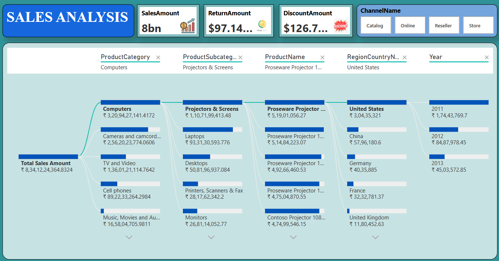

## Contoso Sales Dashboard PowerBI


## 📌 Project Summary

- This project is an interactive Power BI dashboard developed using the Contoso retail dataset to analyze global sales performance, profitability, customer behavior, and product trends. The dashboard transforms raw business data into actionable insights using data modeling, DAX measures, and interactive visualizations to support strategic decision-making.


## 🖼️ Dashboard Preview





## 🛠️ Tools & Technologies Used

| Tool / Technology | Purpose |
|-------------------|----------|
| Power BI | Dashboard Development & Visualization |
| Power Query | Data Cleaning & Transformation |
| DAX | Data Modeling & Calculations |
| Excel / CSV Dataset | Data Source |
| Data Modeling | Relationship Building |
| GitHub | Project Documentation & Version Control |  


## ✨ Key Features

- Interactive sales analytics dashboard  
- Dynamic KPI cards for business monitoring  
- Region-wise and country-wise sales analysis  
- Product category performance tracking  
- Profitability and revenue trend analysis  
- Customer purchasing behavior analysis  
- Drill-through and filter functionality  
- Time intelligence analysis using DAX  
- Responsive and visually optimized dashboard design  
- Business-driven analytical insights  

---

## 🎯 Business Problem Statement

- Contoso operates across multiple regions and product categories, generating large volumes of transactional sales data. Without a centralized analytics system, it becomes difficult to monitor business performance, identify profitable products, track customer trends, and support strategic decision-making.
- This dashboard was developed to solve these challenges by transforming raw sales data into meaningful business insights through interactive visualizations and performance metrics.


## 🚀 Project Objectives

- Analyze overall sales and profit performance  
- Identify top-performing products and categories  
- Evaluate country-wise and region-wise sales trends  
- Track key business KPIs  
- Understand customer purchasing behavior  
- Monitor profitability across segments  
- Build an interactive business intelligence solution  
- Generate actionable business insights


## 📂 Dataset Information

The dataset used in this project contains:  

- Sales Transactions  
- Product Information  
- Customer Details  
- Geographic Data  
- Order Quantity  
- Revenue & Profit Metrics  
- Product Categories  
- Time-based Sales Records

The dataset was cleaned, transformed, and modeled before visualization.


## 🧹 Data Cleaning & Transformation

The following preprocessing steps were performed using Power Query:

- Removed duplicate records
- Handled missing/null values
- Corrected inconsistent data types
- Renamed and standardized columns
- Created calculated columns
- Built date hierarchy
- Optimized tables for reporting
- Established relationships between tables


## 🔗 Data Modeling

A star schema data model was implemented to improve analytical efficiency and dashboard performance.

### Key Relationships

- Sales ↔ Products
- Sales ↔ Customers
- Sales ↔ Geography
- Sales ↔ Calendar Table

The data model enables efficient filtering, aggregation, and KPI calculations across the dashboard.


## 📄 Dashboard Pages

### 1️⃣ Sales Overview Dashboard
- Total Sales
- Total Profit
- Profit Margin
- Sales Trend Analysis
- Monthly Revenue Growth
- KPI Monitoring

### 2️⃣ Product Performance Dashboard
- Top-Selling Products
- Category-wise Revenue
- Product Profitability Analysis
- Quantity Sold Tracking
- Best & Worst Performing Products

### 3️⃣ Regional Analysis Dashboard
- Country-wise Sales
- Regional Profit Analysis
- Market Performance Comparison
- Geographic Revenue Distribution

### 4️⃣ Customer Insights Dashboard
- Customer Purchase Trends
- Customer Segmentation
- Sales Contribution by Customers
- Customer Retention Analysis


## 📊 Key Performance Indicators (KPIs)

| KPI | Description |
|-----|-------------|
| Total Sales | Overall Revenue Generated |
| Total Profit | Net Business Profit |
| Profit Margin | Profitability Percentage |
| Order Quantity | Total Units Sold |
| Top Product | Highest Revenue Product |
| Best Region | Highest Performing Region |
| Sales Growth | Monthly/Yearly Growth Rate |  

## 🧮 DAX Measures Used

```DAX
Total Sales = SUM(Sales[SalesAmount])

Total Profit = SUM(Sales[Profit])

Profit Margin = 
DIVIDE([Total Profit],[Total Sales],0)

Total Orders = 
COUNT(Sales[OrderNumber])

Sales Growth % =
DIVIDE(
    [Current Month Sales] - [Previous Month Sales],
    [Previous Month Sales]
)
```


## ⚙️ Development Process
Step 1: Data Collection

Imported Contoso retail sales dataset into Power BI.

Step 2: Data Cleaning

Performed preprocessing and transformation using Power Query.

Step 3: Data Modeling

Created relationships between fact and dimension tables.

Step 4: DAX Calculations

Developed calculated measures and KPIs using DAX.

Step 5: Dashboard Design

Built interactive dashboards with charts, slicers, and KPI visuals.

Step 6: Business Insights

Generated actionable insights from sales and profitability analysis.


## 📈 Business Insights
- Technology products generated the highest overall profit.
- Certain regions achieved high sales but lower profit margins.
- Seasonal sales spikes were observed during year-end periods.
- A small percentage of products contributed major revenue.
- Customer purchasing trends indicated repeat buying behavior in specific categories.
- Some product categories required pricing optimization due to lower profitability.


## 📚 What I Learned
- Advanced Power BI dashboard development
- Data modeling using star schema
- Writing DAX measures for KPI calculations
- Business intelligence storytelling
- Data cleaning using Power Query
- Interactive report design techniques
- Business-focused analytical thinking
- Performance optimization in Power BI


## ⚠️ Challenges Faced
- Managing complex table relationships
- Optimizing DAX calculations for performance
- Designing visually balanced dashboards
- Handling inconsistent data formats
- Selecting appropriate visualizations for business analysis


## 🚀 Future Improvements
- Integration with real-time data sources
- Sales forecasting using Machine Learning
- Mobile dashboard optimization
- Row-Level Security (RLS) implementation
- Advanced customer segmentation analysis
- AI-driven business insights

## 📈 Overall Growth Through This Project

- This project significantly improved my practical understanding of business intelligence, dashboard design, data storytelling, and analytical problem-solving. It enhanced my ability to transform raw business data into meaningful insights using Power BI and strengthened my skills in data modeling, DAX, and interactive visualization development.


## 🎥 Project Walkthrough Video

- Watch Project Demo Video:
- https://www.linkedin.com/posts/pradnilbirje24_powerbi-dataanalytics-datavisualization-activity-7378763340505944064-1BAA?utm_source=share&utm_medium=member_desktop&rcm=ACoAAEbbC14B8NSwU0I8YzkjYcExH_INtUI9SH4 


## ▶️ Running the Project
- Download the repository  
- Open the .pbix file using Power BI Desktop  
- Refresh the dataset if required  
- Explore the interactive dashboard visuals   


## 👨‍💻 Author
Pradnil Birje  
Data Analyst | SQL | Python | Power BI   
- LinkedIn:  https://www.linkedin.com/in/pradnilbirje24/
- GitHub:  https://github.com/PradnilBirje  
 

## ⭐ Support
If you found this project useful, feel free to star the repository.
